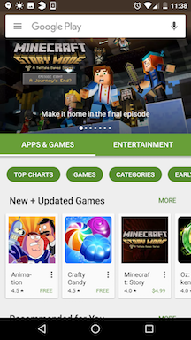
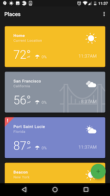

# The Android Lifecycle

## Objectives

- Practice creating a new Android Studio project.
- Understand what an activity is and the role that it plays in an Android app.
- Gain familiarity with the activity lifecycle.
- Learn how to log output to the console.
- Learn how to save the state of an activity through an orientation change.

## Resources

- [Activities](https://developer.android.com/guide/components/activities.html)
- [Managing the Activity Lifecycle](https://developer.android.com/training/basics/activity-lifecycle/index.html)
- [Video: Android Development Tutorial 1](https://www.youtube.com/watch?v=Z149x12sXsw)
- [Video: Android Development Tutorial 2](https://www.youtube.com/watch?v=TgJ5Hho5pAM)
- [Activity API](https://developer.android.com/reference/android/app/Activity.html)

# Lecture

## What is an Activity?

In an Android app, an **activity** is a single, focused thing that the user can do. Activities are where the user will interact with your app - they provide a window for your view and an interface for detecting input from the user and displaying output. Each app may have several activities that the user switches between while the app is running. 

Programmatically, each activity is typically made up of:
- A Java class, e.g. `MainActivity.java`.
- An XML resource file that defines your activity's layout, e.g. `activity_main.xml`.
- An entry in `AndroidManifest.xml` that registers your activity so that it may be invoked by the system.
    
Some example activities:

  

## What is the Activity lifecycle?

As a user navigates into, through, out of and back to your app, the activities in your app transition between different states.

For instance, when the user opens your app from the Launcher screen, the app comes into the foreground of the system and receives user focus. During this process, the Android system calls a series of lifecycle methods on the activity. If the user leaves the app to take a phone call or switches to another app, the system calls another set of lifecycle methods on your activity as it moves into the background.

While there are many different transition states that an activity might be in during this time, there are only three **static states** that activity can exist in for an extended period of time:

- **Resumed:** the activity is in the foreground and the user can interact with it.
- **Paused:** the activity is partially obscured by another activity — for example, an alert dialog or system tray. The paused activity does not receive user input and cannot execute any code.
- **Stopped:** the activity is completely hidden and not visible to the user. While stopped, the activity instance and all its state information such as member variables are retained, but it cannot execute any code.

The **lifecycle methods** are called by the system on your activity depending on the current state of the activity. This is not controlled by the app developer. The developer is given some guarantees -- for example, that `onCreate` is called before `onStart` -- but besides that must write these methods with all sorts of user interactions and flows in mind. 


Within the lifecycle callback methods, you can declare how your activity will behave when the user leaves and re-enters the activity. You do this by overriding the methods in your activity's Java code:

```java
public class MainActivity extends AppCompatActivity
{
    /**
     * Called when the activity is first created - performs any necessary setup to prepare the activity for user interaction.
     *
     * @param savedInstanceState
     */
    @Override
    protected void onCreate(Bundle savedInstanceState)
    {
        super.onCreate(savedInstanceState);
        setContentView(R.layout.activity_main);

    }

    /**
     * Called when the activity is first made at least partially visible to the user.
     */
    @Override
    protected void onStart()
    {
        super.onStart();
    }

    /**
     * Called when the activity  is made completely visible to the user.
     */
    @Override
    protected void onResume()
    {
        super.onResume();
    }

    /**
     * Called when the activity is made only partially visible to the user.
     */
    @Override
    protected void onPause()
    {
        super.onPause();
    }

    /**
     * Called when an activity is no longer visible to the user - can be followed by either onRestart or onDestroy.
     */
    @Override
    protected void onStop()
    {
        super.onStop();
    }

    /**
     * Called when a stopped activity becomes active again.
     */
    @Override
    protected void onRestart()
    {
        super.onRestart();
    }

    /**
     * Called when an activity is destroyed, possibly by the user or by the system.
     */
    @Override
    protected void onDestroy()
    {
        super.onDestroy();
    }
}
```

Understanding the activity lifecycle is important to writing code that makes your app behave the way users expect. You probably won't need to implement all the lifecycle methods for every activity that you write. However, properly implementing activity lifecycle methods is key to making sure that your app:

- Doesn't crash or lose the user's progress if they take a call or switch to another app while using your app.
- Doesn't crash or lose the user's progress when the screen rotates between landscape and portrait orientation.
- Doesn't consume valuable system resources like memory, battery or network data when the user isn't actively using it.


## Logging to the console

Instead of `System.out.print()`, the Android SDK provides a special call for logging: [`Log`](https://developer.android.com/reference/android/util/Log.html). It provides several filterable levels of logging. While debugging during the course of app development you can use the DEBUG level, which is invoked as follows:

```java
Log.d("MainActivity", "myVariable = " + myVariable);
```

**Logcat** is a command-line tool that dumps a log of system messages, including stack traces when the device throws an error and messages that you have written from your app with the `Log` class. You can view logcat output from the Android Monitor panel in Android Studio (⌘6).

A good convention is to declare a `TAG` constant in your class and use that in subsequent calls to the log methods.

```java
private static final String TAG = "MainActivity";

// ...

Log.d(TAG, "myVariable = " + myVariable);
```

## Saving state through an orientation change

When an activity goes into the background, the system may destroy it if resources, like memory, become low. When this happens, any information about the state of the activity is stored in a [`Bundle`](http://developer.android.com/reference/android/os/Bundle.html) so that it can be used to restore the activity. 

Some information about the view hierarchy will be saved automatically by `onSaveInstanceState()`. However, you can override this method in order to save more information about the current activity state to the `Bundle` using key-value pairs. 

```java
    private static final String KEY_MY_STRING = "MY_STRING";

    private String myString;

    @Override
    protected void onSaveInstanceState(Bundle outState) {
        super.onSaveInstanceState(outState);
        outState.putString(KEY_MY_STRING, myString);
    }
```

You can restore state from the `Bundle` either in `onCreate(Bundle savedInstanceState)` or in `onRestoreInstanceState(Bundle savedInstanceState)`, which is called after `onStart()` when restoring the activity.

```java
    private static final String KEY_MY_STRING = "MY_STRING";
    
    private String myString;
    
    @Override
    protected void onCreate(Bundle savedInstanceState) {
        super.onCreate(savedInstanceState);
        setContentView(R.layout.activity_main);
        
        if (savedInstanceState != null) {
            myString = savedInstanceState.getString(KEY_MY_STRING);
        } else {
            myString = "Hello, world!";
        }
    }
```
