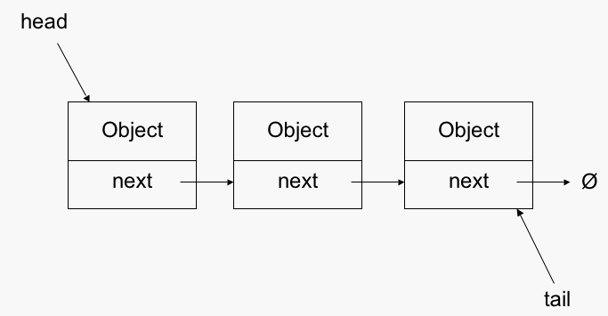

Title: LinkedList

# Objectives

- Review linked lists and implementations of their common methods. 
- Practice traversing linked lists to search for a target value and/or return the list length.
- Understand the difference between singly vs. doubly linked lists.
- Understand a circular linked list and its implementation.

# Resources

- [Visualgo.net - visualizing data structures](http://visualgo.net/)
- [Big O Cheat Sheet](http://bigocheatsheet.com/)
- [LinkedList Java](https://docs.oracle.com/javase/7/docs/api/java/util/LinkedList.html)


## Linked Lists



Let's look at another linear data structure that addresses some of the limitations of arrays. A **linked list** is a data structure consisting of a group of nodes which together represent a sequence.

Simplest form: each element (we will call it a **node**) of a list is comprising of two items - the **data** and a **reference** (aka "link") to the next node. The last node has a reference to `null`. The entry point into a linked list is called the **head** of the list. It should be noted that head is not a separate node, but the reference to the first node. If the list is empty then the head is a `null` reference.

```java
public class Node {
    Node next;
    Object data;
}
```

A linked list is a dynamic data structure, allocating the needed memory while the program is running. The number of nodes in a list is not fixed and it can grow and shrink on demand. 

One disadvantage of a linked list against an array is that it does not allow direct access to the individual elements. If you want to access a particular item then you have to start at the head and follow the references until you get to that item. Also, they have a tendency to use more memory than an array as the references require extra storage space.


## Traversal

A visit to every node of a data structure is called a **traversal**.

To traverse a singly-linked list, we begin at the first node and follow each next link until we come to the end:

```
// Pseudocode

 current node = first node
 while current node is not null
     (do something with current node's data)
     current node = next node
```

## Linked List

We can put all the operations around the nodes in a class, and call it LinkedList

```java
// Linked List Class
class LinkedList
{
    Node head;  // head of list
 
    /* Node Class */
    class Node
    {
        String data;
        Node next;
          
        // Constructor to create a new node
        Node(String d) {data = d; next = null; }
    }
}
```

## Linked List: Adding an item to the list

This method inserts a new Node at front of the list. 
It is defined inside LinkedList class shown above.
New items are added at the head of the list.

```java
/* This function is in LinkedList class.  */
public void add(String new_data)
{
    // create the new node
    Node new_node = new Node(new_data);
 
    // make next of new Node the head 
    new_node.next = head;
 
    /* 4. Move the head to point to new Node */
    head = new_node;
}
```

## Linked List: Traverse and Print list

This function prints contents of linked list starting from head

```java
public void printList()
{
    Node tnode = head;
    while (tnode != null)
    {
        System.out.print(tnode.data+" ");
        tnode = tnode.next;
    }
}
```

### Exercises:

1. Write a method `listLength(Node node)` that receives the head of a singly linked list and returns the number of nodes in the linked list. What is the worst-case runtime complexity of your algorithm?

```java
Node next;
Object data;

public Node(Object data) { 
	this.value = data;
	this.next = null ;
} 

Node node = new Node("Apple");
node.next = new Node("Orange") 
node.next.next = new Node("Banana");
node.next.next.next = new Node("Carrot");
node.next.next.next.next = new Node("Beet");
 
listLength(node); // returns 5 
``` 

2. Write a method called `searchLinkedList(Node head, Object target)` that receives the head of a linked list and target search value, and returns `true` if the target is in the list, or `false` if the target is not in the list. What is the worst-case runtime complexity of your algorithm?

```java
searchLinkedList(list, "Apple"); // returns true
searchLinkedList(list, "Pear"); // returns false
```

## Types of linked lists

### Singly-linked lists

In a singly-linked list every node contains some data and a link to the next node, which allows to keep the structure.


### Doubly-linked lists

In a doubly linked list, each node contains, besides the next-node link, a second link field pointing to the 'previous' node in the sequence.


### Circular linked lists

A **circular linked list** is a variation of linked list in which the first element points to the last element and the last element points to the first element. Both singly -linked lists and doubly-linked lists can be circular.


- In a singly-linked list, the `next` pointer of the last node points to the head node.
- In a doubly-linked list, the `next` pointer of the last node points to the head node and the previous pointer of the head node points to the last node.

### Exercises

1. Write a method `insertAfter(Node node, Node newNode)` that inserts `newNode` directly after the existing `node` in a singly-linked list.

2. Modify your `listLength(Node list)` and `searchLinkedList(Node list, Object target)` solutions to handle a circular singly-linked list.

3. Can you traverse a singly-linked list backwards? What about a circular singly-linked list?

