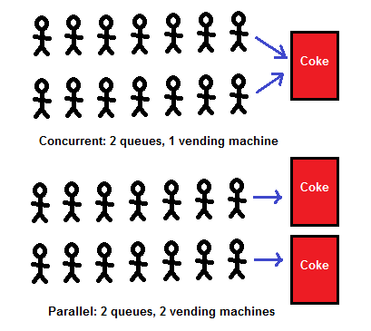
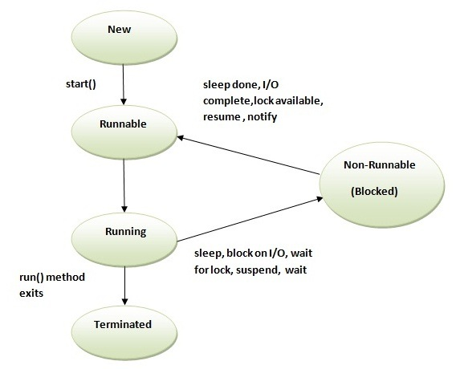

# Title: MultiThreading
Tags: multithreading, concurrency

# Objectives

* Life Cycle of a Thread
* Be able to create and use a Thread
* Be able to manage multiple threads

# Resources

- [Java Concurrency](https://docs.oracle.com/javase/tutorial/essential/concurrency/index.html)

# Concurrency vs Parrellism

Concurrency is *dealing* with many things as once. For example: you laptop is managing the needs of multiple applications at once (not necessarily at the same time).

Parrellism is *doing* many things at once. For example: Dividing the work of cleaning a big hall between multiple people. They all pick their sections and can all clean at once.



# What is Thread in java

*def* A thread is a lightweight sub process, a smallest unit of processing. It is a separate path of execution.

Threads are independent, if there occurs exception in one thread, it doesn't affect other threads. It shares a common memory area.
 


As shown in the above figure, thread is executed inside the process. There is context-switching between the threads. There can be multiple processes inside the OS and one process can have multiple threads.

# What is MultiThreading

*def* Multithreading is a type of execution model that allows multiple threads to exist within the context of a process such that they execute independently but share their process resources..

*Simplified* Multithreading is running multiple threads in a process

Benefits:

* It doesn't block the user because threads are independent and you can perform multiple operations at same time.

* You can perform many operations together so it saves time.

* Threads are independent so it doesn't affect other threads if exception occur in a single thread.

# When to use threads

### Threads make work fast, why not use it all time!
(The Cleaners Problem)

* Asynchronous operations (like downloading a file - because it takes time)

* Operations that can be parallelized (downloading multiple files at a time - because they can be done independently)

* Continual running background operations (like push notifications service always listening for incoming notifications)

# Simple Java Thread code

```java
class Multi3 implements Runnable{  
    public void run(){  
        System.out.println("thread is running...");  
    }  
  
    public static void main(String args[]){  
        Multi3 m1=new Multi3();  
        Thread t1 =new Thread(m1);  
        t1.start(); 
        System.out.println("main is done"); 
    }  
}  
```

# Life cycle of a Thread (Thread States)

* New : The thread is in new state if you create an instance of Thread class but before the invocation of start() method.

* Runnable : A thread executing in the Java virtual machine is in this state.

* Blocked : This is the state when the thread is still alive, but is currently not eligible to run.

* Terminated: A thread is in terminated or dead state when its run() method exits.

Other states may exist such as "waiting", "timed_waiting"

The life cycle of the thread in java is controlled by JVM. 




# Creating a Thread via Runnable Interface

The Runnable interface should be implemented by any class whose instances are intended to be executed by a thread. Runnable interface have only one method named `run()`.

`public void run()`: is used to perform action for a thread.

```java
class Multi3 implements Runnable{  
    public void run(){  
        System.out.println("thread is running...");  
    }  
  
    public static void main(String args[]){  
        Multi3 m1=new Multi3();  
        Thread t1 =new Thread(m1);  
        t1.start();  
    }  
}  
```

### You can also extend the `Thread` class to create a thread.

```java
class Multi extends Thread{  
    public void run(){  
        System.out.println("thread is running...");  
    }  
    public static void main(String args[]){  
        Multi t1=new Multi();  
        t1.start();  
    }  
} 
```

# Commonly used methods of Thread:

* `public void run()`: is used to perform action for a thread.

* `public void start()`: starts the execution of the thread.JVM calls the run() method on the thread.

* `public void sleep(long miliseconds)`: Causes the currently executing thread to sleep (temporarily cease execution) for the specified number of milliseconds.

* `public void join()`: waits for a thread to die.

* `public String getName()`: returns the name of the thread.

* `public void setName(String name)`: changes the name of the thread.

* `public Thread currentThread()`: returns the reference of currently executing thread.

* `public Thread.State getState()`: returns the state of the thread.

* `public boolean isAlive()`: tests if the thread is alive.

* `public void yield()`: causes the currently executing thread object to temporarily pause and allow other threads to execute.

* `public void suspend()`: is used to suspend the thread(depricated).

* `public void resume()`: is used to resume the suspended thread(depricated).

* `public void stop()`: is used to stop the thread(depricated).

* `public void interrupt()`: interrupts the thread.


# Thread examples

```java
class RunnableDemo implements Runnable {
   private Thread t;
   private String threadName;
   
   RunnableDemo( String name) {
      threadName = name;
      System.out.println("Creating " +  threadName );
   }
   
   public void run() {
      System.out.println("Running " +  threadName );
      try {
         for(int i = 4; i > 0; i--) {
            System.out.println("Thread: " + threadName + ", " + i);
            // Let the thread sleep for a while.
            Thread.sleep(50);
         }
      }catch (InterruptedException e) {
         System.out.println("Thread " +  threadName + " interrupted.");
      }
      System.out.println("Thread " +  threadName + " exiting.");
   }
   
   public void start () {
      System.out.println("Starting " +  threadName );
      if (t == null) {
         t = new Thread (this, threadName);
         t.start ();
      }
   }
}

public class TestThread {

   public static void main(String args[]) {
      RunnableDemo R1 = new RunnableDemo( "Thread-1");
      R1.start();
      
      RunnableDemo R2 = new RunnableDemo( "Thread-2");
      R2.start();
   }   
}
```

## Shared State and Synchronization


# More examples

See [SimpleThreads.java](SimpleThreads.java)

# Summary

* Threads allow us to split expensive task and run the pieces in parallel
* Threads can be in one of 4 main states - new, runnable, blocked, terminated
* Life Cycle of a Thread
* Be able to create and use a Thread
* Be able to manage multiple threads


# Exercises

**Question 1**
Write a program called SharedCounter.java in which 10 threads each increment a shared int counter 1000 times. When all the threads have finished, print the final value of the counter. Counter is initialized to zero and you should always get 10000 

[Further] Arrange for your code to sometimes print the wrong answer. (Hint: try using some well-placed calls to Thread.yield() or Thread.sleep().)


**Question 2**
