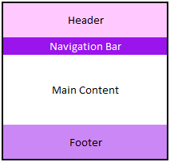
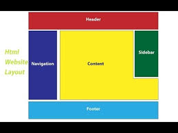
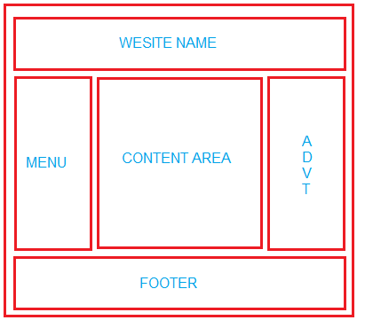

## Title: XML 
### Introduction, Views and Serialization
Tags: Some, tags

---

## Warm up

Creat a "hello world!" andriod app... from scratch

---

## Objectives

* Understand XML, Schema and Namespaces
* Learn how to use XML syntax
* Use XML to represent data
* Serialize data to and from XML
* Understand basic layout techniques in XML

---

## What is XML

* XML stands for eXtensible *Markup* Language
* XML is a markup language much like HTML
* XML was designed to store and transport data
* XML was designed to be self-descriptive

---

## XML Does Not DO Anything

Maybe it is a little hard to understand, but XML does not DO anything.

This note is a note to Tove from Jani, stored as XML: 

```xml
<note>
  <to>Tove</to>
  <from>Jani</from>
  <heading>Reminder</heading>
  <body>Don't forget me this weekend!</body>
</note>
```

You can store information about a Java data-class as XML

---

## XML Does Not Use Predefined Tags

* The XML language has no predefined tags. No such things as `if`, `while` keywords. No keywords.

* The tags in the example above (like <to> and <from>) are not defined in any XML standard. These tags are "invented" by the author of the XML document.

* Android creates some predefined tags like <Layout>, <Button>, <TextView>, etc.

* With XML, the author must define both the tags and the document structure.

---

## Anatomy of XML Markup

```xml
1 <?xml version="1.0" encoding="UTF-8"?>  
2 <!-- A note model -->                   
3 <note>                                                      
4   <id type="number">23</id>                                
5   <to type="string">Tove</to>
6   <from type="string">Jani</from>
7   <heading type="string" size="big">Reminder</heading>    
8   <body type="string">Don't forget me this weekend!</body>
9   <created type="date">June 1, 2017</created>
10 </note>
```

* line 1 is the **xml prolog**, the only **required** tag in *valid* xml 
* line 2 is a xml comment, opens with `<!--` and closes with `-->`
* line 3-10 are user defined tags
* `type` on line 4 is an **attribute** whose **value** is `number`

---

## What are the Rules? None*

* As many tags as you want
* A tag can go as deep as it wants
* A tag can have as many attributes as it wants
* Anything can be used as a tag: `<lol:2>`

---

#### But...

* There is only 1 root element (the declaration doesn't count)
* You must close every tag you open.
* Tag names are case sensitive, `<P>` is different from `<p>`
* The nesting must be proper: `<a><b> </b></a>`
* Attribute values *must* be quoted: `<movie author="James Bond">007</movie>`
* You cannot use `<` and `>` anyhow because...? Use `&lt;` and `&gt;`

---

## Namespaces

XML Namespaces provide a method to avoid element name conflicts.

Imagine you wanted to use `<table>` but someone else (like the android system or a browser) has already defined `<table>`

Format is `<namespace:tag>`

Their schema location is specified in the **xml prolog**

---

## Namespaces: Example

Here are two different kinds of table under different namespaces `h` and `f`:

```xml
<root xmlns:h="http://www.w3.org/TR/html4/"
xmlns:f="https://www.w3schools.com/furniture">

    <h:table>
    <h:tr>
        <h:td>Apples</h:td>
        <h:td>Bananas</h:td>
    </h:tr>
    </h:table>

    <f:table>
    <f:name>African Coffee Table</f:name>
    <f:width>80</f:width>
    <f:length>120</f:length>
    </f:table>

</root>
```

---

## Namespaces in Real Use

Here is a basic android view. How many Namespaces are there?

```xml
<?xml version="1.0" encoding="utf-8"?>
<android.support.constraint.ConstraintLayout 
    xmlns:android="http://schemas.android.com/apk/res/android"
    xmlns:app="http://schemas.android.com/apk/res-auto"
    xmlns:tools="http://schemas.android.com/tools"
    android:layout_width="match_parent"
    android:layout_height="match_parent"
    tools:context="com.example.justiceo.myapplication.MainActivity">

    <TextView
        android:layout_width="wrap_content"
        android:layout_height="wrap_content"
        android:text="Hello World!"
        app:layout_constraintBottom_toBottomOf="parent"
        app:layout_constraintLeft_toLeftOf="parent"
        app:layout_constraintRight_toRightOf="parent"
        app:layout_constraintTop_toTopOf="parent" />

</android.support.constraint.ConstraintLayout>
```

---

## XML in Practice: Representing Data

How would we represent note xml as a java class?

```xml
<note>
  <to>Tove</to>
  <from>Jani</from>
  <heading>Reminder</heading>
  <body>Don't forget me this weekend!</body>
</note>
```

Represent [Books.xml](books.xml) as a Java object

---

## XML in Practice: Describing Views

* XML is used for describing views for displaying web pages (HTML) android apps (Views)
* HTML is the standard markup language for creating Web pages.
* HTML stands for Hyper Text Markup Language
* HTML elements are represented by tags
* HTML tags label pieces of content such as "heading", "paragraph", "table", and so on
* Browsers do not display the HTML tags, but use them to render the content of the page

---

## XML in Practice: Basic HTML Layout

To image below is a basic layout of mobile web pages.



The HTML representation would like:
```html
<body style="text-align:center; text-transform: uppercase">
    <div style="padding:20px; background: pink">Header</div>
    <div style="padding:10px; background: magenta">Navigation Bar</div>
    <div style="min-height:200px; padding-top:100px">Main Content</div>
    <div style="padding:20px; background: magenta">Footer</div>
</body>
```

Preview using [Repl.it for HTML](https://repl.it/languages/web_project)

---

## XML in Practice: Exercise

How can we represent the layout below in html?


---

## XML in Practice: Object Serialization

* Serialization is the process of converting an object into a stream of bytes in order to store the object or transmit it to memory, a database, or a file. 
* Its main purpose is to save the state of an object in order to be able to recreate it when needed. 
* The reverse process is called deserialization.

The steps for saving object as XML:
* Describe the class using annotations
* Marshall the object into a XML representation
* Write it to a file or print to console

---

## XML in Practice: Serializing Java Objects

See [Object Serialization code example](ObjectSerializationExample.java)

---

## Summary

* XML was designed to carry data - with focus on what data is
* Is very extensible - no predefined tags
* Namespaces resolve conflicts on conflicting tags
* XML can be used to describe views and layouts on different platforms
* Xml can be used to serialize complex data structures.

---

## Exercises

> ** Question 1 ** 

Describe the java class below as a XML document. 

Imagine someone needs to be able to recreate the class exactly just based on the XML document.

```java
public class Car {
    public String name;
    protected String model;
    private int mileage;

    private class Engine {
        public int size;
        public String make;
        public double horsePower;
    }
    
}
```

---

## Exercises

> ** Question 2 **

Describe a XML representation for the image below




## It Doesn't Stop There...

All Android layouts and view elements are represented using XML.

This lecture is a lead-in to [Android Layouts](../Lecture-4-Layouts-XML-in-Android/)

---

## Bye!