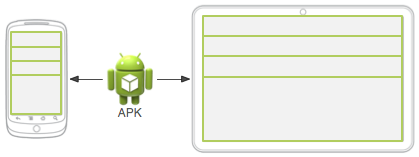
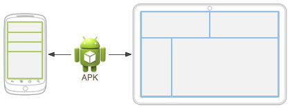
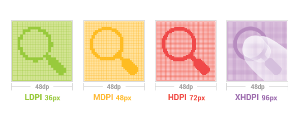

- title: Android Resources 2
- tags: resources, internationalization,

# Objectives

- Practice storing external resources in xml
- Retrieve external resources like strings, arrays, and drawables in Java code
- To explore how Android manages external resources such as strings, layouts, and drawables.

# Resources

- [Spinner Class](https://developer.android.com/guide/topics/ui/controls/spinner.html)
- [ArrayAdapters](https://developer.android.com/reference/android/widget/ArrayAdapter.html)
- [App Resources Docs](http://developer.android.com/guide/topics/resources/index.html)

# Lecture

We can think of the resources directory of an Android app as containing static bits of information outside the java source code. Some examples of things we may store in the res/ directory include externalized strings, drawables, layouts, dimens, and style. With the exception of drawable images, you will be able to edit these resources directly in xml using Android studio.

```xml
<resources>
    <string name="app_name">Android Grocery Store</string>
</resources>
```   
External resources may be generally referenced in Java code by using the R keyword which stands for resource. The following java code for example, programmatically changes an imageview's background.


```java
imageView = (ImageView) findViewById(R.layout.activity_main);
imageView.setImageResource(R.drawable.marshmallow);
```


 NB: In this example, R.drawable.marshmallow is actually an integer type serving as a reference to the marshmallow image and not the image itself.

 ##### Overview of Android Resource Directories


You should always externalize resources such as images and strings from your application code, so that you can maintain them independently. Externalizing your resources also allows you to provide alternative resources that support specific device configurations such as different languages or screen sizes, which becomes increasingly important as more Android-powered devices become available with different configurations. In order to provide compatibility with different configurations, you must organize resources in your project's `res/` directory, using various sub-directories that group resources by type and configuration.


For any type of resource, you can specify `default` and `alternative` resources for your application:

- Default resources are those that should be used regardless of the device configuration or when there are no alternative resources that match the current configuration.
- Alternative resources are those that you've designed for use with a specific configuration. To specify that a group of resources are for a specific configuration, append an appropriate configuration qualifier to the directory name.


<br />
Figure 1. Two different devices, each using the default layout (the app provides no alternative layouts).


<br />


<br />
Figure 2. Two different devices, each using a different layout provided for different screen sizes.


### Providing Resources
You should always externalize application resources such as images and strings from your code, so that you can maintain them independently. You should also provide alternative resources for specific device configurations, by grouping them in specially-named resource directories. At runtime, Android uses the appropriate resource based on the current configuration.

Once you externalize your application resources, you can access them using resource IDs that are generated in your project's R class. 

Grouping Resource Types
You should place each type of resource in a specific subdirectory of your project's res/ directory. For example, here's the file hierarchy for a simple project:

```
MyProject/
    src/  
        MyActivity.java  
    res/
        drawable/  
            graphic.png  
        layout/  
            main.xml
            info.xml
        mipmap/  
            icon.png 
        values/  
            strings.xml 
```

As you can see in this example, the res/ directory contains all the resources (in subdirectories): an image resource, two layout resources, mipmap/ directories for launcher icons, and a string resource file. 


| Folder    | Resource Type                                  |
|-----------|------------------------------------------------|
| drawable/	|                                                |
|           |  Bitmap files (.png, .9.png, .jpg, .gif) or    |
|           |  XML files that are compiled into the          |
|           |    following drawable                          |
| --------- | ---------------------------------------------- |
| layout/   | XML files that define a user interface layout. |
| --------- | ---------------------------------------------- |
|           |                                                |
| mipmap/	| Drawable files for different launcher icon     |
|           | densities.                                     |
| --------- | ---------------------------------------------- |
|           |                                                |
| values/   | XML files that contain simple values, such as  |
|           | strings, integers, and colors.                 |


### Providing Alternative Resources

Almost every application should provide alternative resources to support specific device configurations. For instance, you should include alternative drawable resources for different screen densities and alternative string resources for different languages. At runtime, Android detects the current device configuration and loads the appropriate resources for your application.

To specify configuration-specific alternatives for a set of resources:

Create a new directory in `res/` named in the form `<resources_name>-<config_qualifier>`

- <resources_name> is the directory name of the corresponding default resources

- <qualifier> is a name that specifies an individual configuration for which these resources are to be used 

You can append more than one <qualifier>. Separate each one with a dash.

For example, here are some default and alternative resources:

```
res/
    drawable/   
        icon.png
        background.png    
    drawable-hdpi/  
        icon.png
        background.png  
```

The hdpi qualifier indicates that the resources in that directory are for devices with a high-density screen. The images in each of these drawable directories are sized for a specific screen density, but the filenames are exactly the same. This way, the resource ID that you use to reference the icon.png or background.png image is always the same, but Android selects the version of each resource that best matches the current device, by comparing the device configuration information with the qualifiers in the resource directory name.

##### Overview of Resource Qualifiers

Various to choose from:
- Language and region	
  Examples: en, fr, en-rUS, fr-rFR, fr-rCA

- Screen pixel density (dpi)
  Examples: ldpi, mdpi, hdpi, xhdpi

# Accessing Resources
Once you provide a resource in your application (discussed in Providing Resources), you can apply it by referencing its resource ID. All resource IDs are defined in your project's R class, which the aapt tool automatically generates.

When your application is compiled, aapt generates the R class, which contains resource IDs for all the resources in your res/ directory. For each type of resource, there is an R subclass (for example, R.drawable for all drawable resources), and for each resource of that type, there is a static integer (for example, R.drawable.icon). This integer is the resource ID that you can use to retrieve your resource.


Although the R class is where resource IDs are specified, you should never need to look there to discover a resource ID. A resource ID is always composed of:

The resource type: Each resource is grouped into a "type," such as string, drawable, and layout. For more about the different types, see Resource Types.
The resource name, which is either: the filename, excluding the extension; or the value in the XML android:name attribute, if the resource is a simple value (such as a string).
There are two ways you can access a resource:

`In code:` Using a static integer from a sub-class of your R class, such as:
R.string.hello
string is the resource type and hello is the resource name. There are many Android APIs that can access your resources when you provide a resource ID in this format. See Accessing Resources in Code.
<br />
`In XML:` Using a special XML syntax that also corresponds to the resource ID defined in your R class, such as:
@string/hello
string is the resource type and hello is the resource name. You can use this syntax in an XML resource any place where a value is expected that you provide in a resource. See Accessing Resources from XML.


##### Pixels and density

- dots per inch (dip) - resolution divided by screen area
- density independent pixels (dp)


<br />
![pic2] (./images/pixel-density-3.png)
<br />
[density independent pixels - youtube](https://www.youtube.com/watch?v=zhszwkcay2A)


##### Configuration Changes

##### Accessing Resources
During your application development you will need to access defined resources either in your code, or in your layout XML files. Following section explains how to access your resources in both the scenarios:

##### ACCESSING RESOURCES IN CODE
When your Android application is compiled, a R class gets generated, which contains resource IDs for all the resources available in your res/ directory. You can use R class to access that resource using sub-directory and resource name or directly resource ID.

EXAMPLE:
To access res/drawable/myimage.png and set an ImageView you will use following code:

```java
ImageView imageView = (ImageView) findViewById(R.id.myimageview);
imageView.setImageResource(R.drawable.myimage);
```

Here first line of the code make use of R.id.myimageview to get ImageView defined with id myimageview in a Layout file. Second line of code makes use of R.drawable.myimage to get an image with name myimage available in drawable sub-directory under /res.

EXAMPLE:
Consider next example where res/values/strings.xml has following definition:

```xml
<?xml version="1.0" encoding="utf-8"?>
<resources>
    <string  name="hello">Hello, World!</string>
</resources>
```
Now you can set the text on a TextView object with ID msg using a resource ID as follows:

```java
TextView msgTextView = (TextView) findViewById(R.id.msg);
msgTextView.setText(R.string.hello);
```

EXAMPLE:
Consider a layout res/layout/activity_main.xml with the following definition:

```xml
<?xml version="1.0" encoding="utf-8"?>
<LinearLayout xmlns:android="http://schemas.android.com/apk/res/android"
   android:layout_width="fill_parent" 
   android:layout_height="fill_parent" 
   android:orientation="vertical" >
<TextView android:id="@+id/text"
   android:layout_width="wrap_content"
   android:layout_height="wrap_content"
   android:text="Hello, I am a TextView" />
<Button android:id="@+id/button"
   android:layout_width="wrap_content"
   android:layout_height="wrap_content"
   android:text="Hello, I am a Button" />
</LinearLayout>
```

This application code will load this layout for an Activity, in the onCreate() method as follows:

```java
public void onCreate(Bundle savedInstanceState) {
    super.onCreate(savedInstanceState);
    setContentView(R.layout.main_activity);
}
```

##### ACCESSING RESOURCES IN XML
Consider the following resource XML res/values/strings.xml file that includes a color resource and a string resource:

```xml
<?xml version="1.0" encoding="utf-8"?>
<resources>
   <color name="opaque_red">#f00</color>
   <string name="hello">Hello!</string>
</resources>
```
Now you can use these resources in the following layout file to set the text color and text string as follows:

```xml
<?xml version="1.0" encoding="utf-8"?>
<EditText xmlns:android="http://schemas.android.com/apk/res/android"
    android:layout_width="fill_parent"
    android:layout_height="fill_parent"
    android:textColor="@color/opaque_red"
    android:text="@string/hello" />
```

## Other Resources

We can also use the res/ directory to store information about booleans, color, and layouts for Android menu's. Here is an example of an xml resource that represents boolean values.


## Storing booleans in an xml file.

```
<?xml version="1.0" encoding="utf-8"?>
<resources>
    <bool name="screen_small">true</bool>
    <bool name="adjust_view_bounds">true</bool>
</resources>
```

To retrieve the boolean value in Java code, we can do the following:

```java
Resources res = getResources();
boolean screenIsSmall = res.getBoolean(R.bool.screen_small);
```

We can also reference resource properties in other xml files. Here's an xml snippet referencing an external bool resource.

```xml
<ImageView
    android:layout_height="fill_parent"
    android:layout_width="fill_parent"
    android:src="@drawable/logo"
    android:adjustViewBounds="@bool/adjust_view_bounds"/>
```


## Some thoughts on Resources
- External resources are distinct from Java source code because they are in a different format (xml)
- Also distinct because we can have multiple definitions of a resource to be used in different circumstances. (think: internationalization and localization)


## Mob-Programming Activity

- Store the 12 months of the year as strings in your res/values/strings.xml file.

- In activity_main, define a vertical linear layout with buttons for each month. For now, we just want to print a Log statement when the user clicks each button and present a Toast notifying us which button was selected.

We can also use resources to represent String arrays and Integer arrays. This code snippet shows an xml file containing an array of the most recent Android flavors.

```xml
<resources>
    <string-array
        name="android-flavors">
        <item>@string/nougat</item>
        <item>@string/marshmallow</item>
        <item>@string/lollipop</item>
        <item>@string/kitkat</item>
        <item>@string/jellybean</item>
    </string-array>
</resources>
```


- Modify your resource layer to store your months data as a string-array, and retrieve this array in java code.


## Exercise 2

- Using images from the internet, we are going to build a Birthday Card app that allows a user to cycle through different birthday card images.

Start with finding some birthday card images from the internet to add to your drawable directory, and replacing your linear layout of buttons with a spinner view and an imageview. We will visit the spinner soon, but for now let's make this app more dynamic. Clicking the image should change the imageview's content to the next image in your drawable folder.


**  Adapters are a way to provide data to a view and create subviews for each item in the data set. Think about your facebook news feed or a Netflix gallery of movies. They are content that come from a data source and are represented in a consistent way perhaps in a grid or list.

In Android, adapter views are views whose children are determined by an adapter. Examples include ListView, GridView, and Spinner.

We will use the [array adapter](https://developer.android.com/reference/android/widget/ArrayAdapter.html) class to populate our spinner dropdown menu with the necessary content. We will need to

1) instantiate our spinner in Java code
2) Instantiate an ArrayAdapter with the array of months.
3) Call `setAdapter()` on the spinner view to populate its child views
4) Use an OnItemSelectedListener to determine which item was selected.

```java
// Retrieving array of months from xml
String[] months = getResources().getStringArray(R.array.string_array_months);

/*Instantiating a new ArrayAdapter and supplying the following parameters:
1) the current context (MainActivity.this)

2) a layout containing a textview for rendering each subview of the spinner

3) The array of months or data set*/
ArrayAdapter adapter = new ArrayAdapter(this, R.layout.text_layout, months);

// Sets the adapter for the spinner providing the data and look for the spinner widget.
spinner.setAdapter(adapter);
```

### Individual exercises

- Add a button to your MainActivity that navigates the user to another activity with a listview of language choices to get the birthday greeting in.

- The common greetings should be stored in the appropriate res subdirectory.
